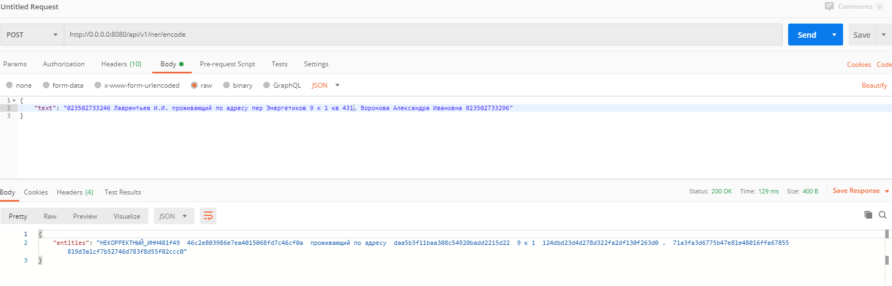
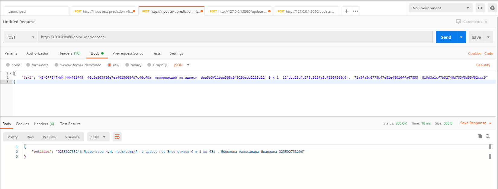

# NER_RU

Что нового?
- Async FastAPI. Докер поднимается, протестировано Postman-ом
- Словарь с зашифрованными данными хранится на серве. После каждого запроса на зашифровку обновляется (наверно не супер - приходится открывать файл и обновлять его). 
- Изменена структура экстактора NER, теперь pipeline с процессингом и заменой ner лежит внутри, а не снаружи (раньше был в encode.py и decode.py).
- Теперь некоррентные ИНН тоже шифруются и дешифруются. FYI данный код работает только для физ лиц (12 чисел ИНН).

## Test
Encoding

Decoding

## TODO

-Сделать тесты
-Сделать Loadtest
